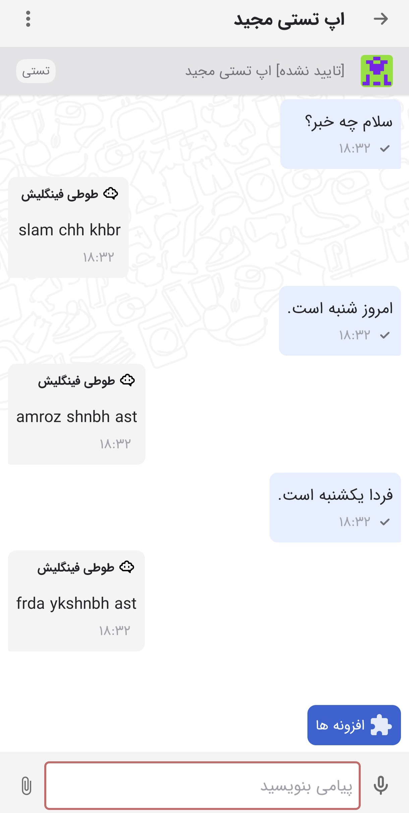

# Finglish Parrot 🦜

## Introduction
Just a fun project to integrate with [kenar-divar](https://github.com/divar-ir/kenar-docs/tree/master) ChatBot APIs.  
**Finglish Parrot** just translates your Persian messages into the [Finglish mode](https://fa.wikipedia.org/wiki/%D9%84%D8%A7%D8%AA%DB%8C%D9%86%E2%80%8C%D9%86%D9%88%DB%8C%D8%B3%DB%8C_%D9%81%D8%A7%D8%B1%D8%B3%DB%8C).  
Don't expect much from it ¯\_(ツ)_/¯.

## Up and Running
You can use docker to run the project:
```bash
docker compose up -d
```

Consider the `ngrok` container and set these values on your `.env` file from [your ngrok profile](http://ngrok.com/):
```
NGROK_DOMAIN=
NGROK_AUTHTOKEN=
```

Also consider the divar authorization related fields on your `.env` file:
```
DIVAR_AUTHENTICATION=
DIVAR_X_API_KEY=
```

## Result
<br>


